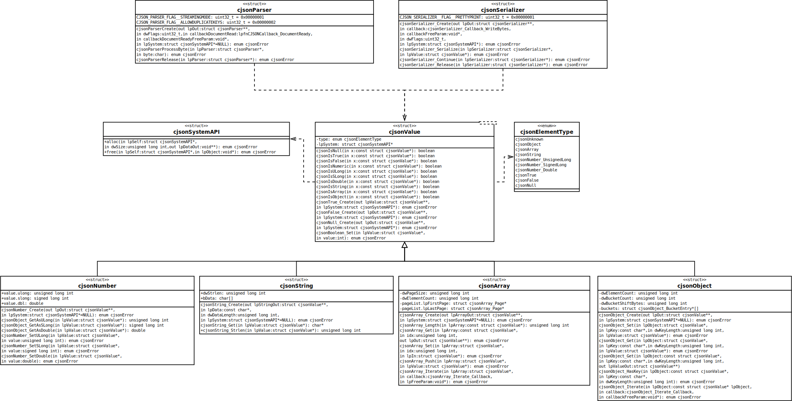

# ANSI C99 JSON serializer / deserializer

This is a small ANSI C99 library that provides an easy interface to deserialize
arbitrary UTF-8 JSON input into an abstract tree as well as methods to
traverse through the tree and to re-serialize such an internal representation
into JSON again.

This library has no external dependencies except the libc. Currently
libc is used for memory management as well as snprintf to print
unsigned long, signed long and double values.

## Reading JSON input<a name="jsonread">

To read JSON input one has to create a parser that will call a given
callback for every decoded JSON document inside the stream. There are
flags that control the behaviour of the parser (they can be combined
with binary or):

* `CJSON_PARSER_FLAG__ALLOWDUPLICATEKEYS` enables the parser to allow
  duplicate keys inside JSON Objects
* `CJSON_PARSER_FLAG__STREAMINGMODE` enables streaming mode. In this
  mode the parser is capable of continuing parsing after the first
  document that has been encountered. If this bit is not set any
  data following the first root element is an syntax error

```
static enum cjsonError documentReadyCallback(
    struct cjsonValue* lpDocument,
    void* lpFreeParam
) {
    /* Do whatever you want with the document */
    return cjsonE_Ok;
}
```

```
struct cjsonParser* lpParser;
enum cjsonError e;

e = cjsonParserCreate(
    &lpParser,
    0, /* Or CJSON_PARSER_FLAG__ALLOWDUPLICATEKEYS|CJSON_PARSER_FLAG__STREAMINGMODE */
    &documentReadyCallback,
    NULL,
    NULL
);
if(e != cjsonE_Ok) {
    /* Perform error handling */
}
```

After that one has to feed the parser with bytes from the input stream and
after finishing input one has to release the parser again:

```
for(...) { /* Iterate over input bytes */
    e = cjsonParserProcessByte(lpParser, nextInputByte);
    if(e != cjsonE_Ok) {
        /* Do error handling */
    }
}
cjsonParserRelease(lpParser);
```

## Writing JSON output<a name="jsonwrite">

One can write any JSON element (`struct cjsonValue`) into an output stream
by using the serializer. The serializer supports optional pretty-print which
adds formatting that makes human reading of the output simpler. When automatic
parsing is desired one should not set the `CJSON_SERIALIZER__FLAG__PRETTYPRINT`
flag.

An callback to write output byte(s) is also required:

```
static enum cjsonError outputWriterRoutine(
   char* lpData,
   unsigned long int dwBytesToWrite,

   unsigned long int *lpBytesWrittenOut,

   void* lpFreeParam
) {
   /* Do whatever is required to write the bytes */

   /* We always have to update lpBytesWrittenOut! */
   (*lpBytesWrittenOut) = ...;
}
```

```
struct cjsonSerializer* lpSerializer;
enum cjsonError e;

e = cjsonSerializer_Create(
   &lpSerializer,
   &outputWriterRoutine,
   NULL, /* Parameter arbitrarily useable by outputWriterRoutine */
   CJSON_SERIALIZER__FLAG__PRETTYPRINT,
   NULL /* One can supply an custom memory allocation interface here */
);
```

Then any JSON value can be serialized and the serializer can be
released:

```
struct cjsonValue* value;

e = cjsonSerializer_Serialize(lpSerializer, value);
/* Do error handling */

e = cjsonSerializer_Release(lpSerializer);
/* Do error handling */
```

## Traversing an JSON tree and accessing values<a name="jsonaccess">

To determine the type of an `struct jsonValue*` one can use the following
macros:

* `cjsonIsNull` returns true if the value has been constant `null`
* `cjsonIsTrue` returns true if the value has been constant `true`
* `cjsonIsFalse` returns true if the value has been constant `false`
* `cjsonIsNumeric` returns true if the value has been any of the numeric types
* `cjsonIsULong` value is represented as unsigned long
* `cjsonIsSLong` value is represented as signed long
* `cjsonIsDouble` value is represented as double precision floating point value
* `cjsonIsString` the JSON element is an arbitrary string
* `cjsonIsArray` an ordered list of JSON elements
* `cjsonIsObject` an unordered key-value store

All values can be released via

```
void cjsonReleaseValue(
    struct cjsonValue* lpValue
);
```

### Accessing ordered lists (arrays)<a name="jsonaccessarray">

Arrays are implemented internally as linked list of ordered arrays (i.e. an
Arraylist). They can be created empty, new items can then be pushed into the
array via the `cjsonArray_Push` function until it has reached it's target size.

One can fetch and replace elements in the range returned by `cjsonArray_Length`
via the `cjsonArray_Get` and `cjsonArray_Set` functions which adress the
elements via their index.

```
enum cjsonError cjsonArray_Create(
	struct cjsonValue**	lpArrayOut,
	struct cjsonSystemAPI* lpSystem
);
unsigned long int cjsonArray_Length(
	const struct cjsonValue* lpArray
);
enum cjsonError cjsonArray_Get(
	const struct cjsonValue* lpArray,
	unsigned long int 	idx,
	struct cjsonValue** lpOut
);
enum cjsonError cjsonArray_Set(
	struct cjsonValue* 	lpArray,
	unsigned long int 	idx,
	struct cjsonValue* 	lpIn
);
enum cjsonError cjsonArray_Push(
	struct cjsonValue* 	lpArray,
	struct cjsonValue* 	lpValue
);
typedef enum cjsonError (*cjsonArray_Iterate_Callback)(
	unsigned long int index,
	struct cjsonValue* lpValue,
	void* lpFreeParam
);
```

If one needs to iterate over all elements one can also use the iterator
function. This methods calls an callback function of type
`cjsonArray_Iterate_Callback` for every element in the array.

```
enum cjsonError cjsonArray_Iterate(
	struct cjsonValue* lpValue,
	cjsonArray_Iterate_Callback callback,
	void* lpFreeParam
);
```

Iterator usage may look like the following sample:

```
static enum cjsonError jsonArrayIterator(
	unsigned long int index,
	struct cjsonValue* lpValue,
	void* lpFreeParam
) {
	/*
		Do whatever you want with lpValue.
		
		Do not modify the array during iteration!
	*/

    return cjsonE_Ok;
}


...
    e = cjsonArray_Iterate(lpValue, &jsonArrayIterator, NULL);
...
```

### Accessing key-value stores (objects)<a name="jsonaccessobject">

Objects represent unordered key-value stores. They may (if the parser has
been instructed to tolerate it) contain multiple values per key but normally
when used in RFC conformant mode should provide a unique mapping between
keys and values. Values can be any `cjsonValue` type, keys are always UTF-8
strings. This library does not interpret the key strings in any way. Objects
are implemented as hashmaps with a fixed number of buckets that can be
tuned via the `CJSON_BLOCKSIZE_OBJECT` compile time definition. Note that since
it's a hashtable the best case lookup speed is O(1) but the worst case in which
all elements are hashed into the same bucket is O(n).

To remove an element one can store `NULL` at its key.

Access is mainly done via `cjsonObject_Set` and `cjsonObject_Get` functions.
If one wants to check if a key is present one can use the `cjsonObject_HasKey`
method.

```
enum cjsonError cjsonObject_Create(
    struct cjsonValue** lpOut,
    struct cjsonSystemAPI* lpSystem
);
enum cjsonError cjsonObject_Set(
    struct cjsonValue* lpObject,
    const char* lpKey,
    unsigned long int dwKeyLength,
    struct cjsonValue* lpValue
);
enum cjsonError cjsonObject_Get(
    const struct cjsonValue* lpObject,
    const char* lpKey,
    unsigned long int dwKeyLength,
    struct cjsonValue** lpValueOut
);
enum cjsonError cjsonObject_HasKey(
    const struct cjsonValue* lpObject,
    const char* lpKey,
    unsigned long int dwKeyLength
);
```

As with arrays objects provide an easy way to iterate over all contained child
objects - and iterator function. Note that the order in which the data is returned
is arbitrary.

```
typedef enum cjsonError (*cjsonObject_Iterate_Callback)(
    char* lpKey,
    unsigned long int dwKeyLength,
    struct cjsonValue* lpValue,
    void* lpFreeParam
);
enum cjsonError cjsonObject_Iterate(
    const struct cjsonValue* lpObject,
    cjsonObject_Iterate_Callback callback,
    void* callbackFreeParam
);
```

### Accessing numeric types<a name="jsonaccessnumeric">

Numeric types are stored internally either as unsigned long, signed long
or double precission floating point value. Getting the value as a different
type (for example reading an double as unsigned long) leads to loss of
precision and information but is possible.

```
enum cjsonError cjsonNumber_Create(
    struct cjsonValue** lpOut,
    struct cjsonSystemAPI* lpSystem
);
unsigned long int cjsonObject_GetAsULong(
    struct cjsonValue* lpValue
);
signed long int cjsonObject_GetAsSLong(
    struct cjsonValue* lpValue
);
double cjsonObject_GetAsDouble(
    struct cjsonValue* lpValue
);
enum cjsonError cjsonNumber_SetULong(
    struct cjsonValue* lpValue,
    unsigned long int value
);
enum cjsonError cjsonNumber_SetSLong(
    struct cjsonValue* lpValue,
    signed long int value
);
enum cjsonError cjsonNumber_SetDouble(
    struct cjsonValue* lpValue,
    double value
);
```

### Accessing strings<a name="jsonaccessstring">

```
enum cjsonError cjsonString_Create(
    struct cjsonValue** lpStringOut,
    const char* lpData,
    unsigned long int dwDataLength,
    struct cjsonSystemAPI* lpSystem
);
char* cjsonString_Get(
    struct cjsonValue* lpValue
);
unsigned long int cjsonString_Strlen(
    struct cjsonValue* lpValue
);
```

### Accessing constants<a name="jsonaccessconst">

Constants are simply the three allowed JSON constants
`true`, `false` and `null`. The boolean constants can
be modified via the `cjsonBoolean_Set` function which
can convert a `cjsonTrue` type into `cjsonFalse` and
vice versa.

```
enum cjsonError cjsonTrue_Create(
    struct cjsonValue** lpOut,
    struct cjsonSystemAPI* lpSystem
);
enum cjsonError cjsonFalse_Create(
    struct cjsonValue** lpOut,
    struct cjsonSystemAPI* lpSystem
);
enum cjsonError cjsonNull_Create(
    struct cjsonValue** lpOut,
    struct cjsonSystemAPI* lpSystem
);
enum cjsonError cjsonBoolean_Set(
    struct cjsonValue* lpValue,
    int value
);
```

## UML overview of the public API

